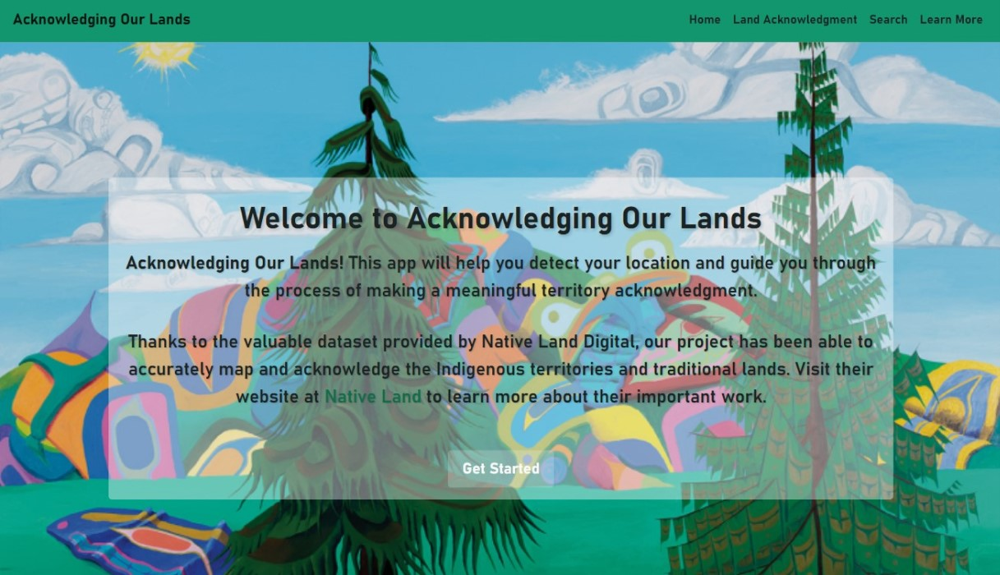
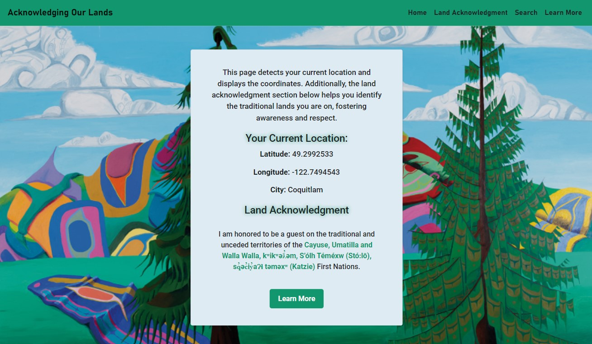
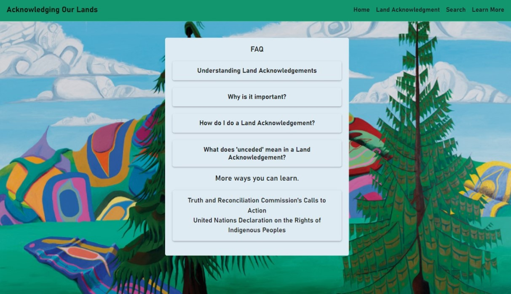

<h1 align="center">Acknowledging Our Lands</h1>

  <strong>Acknowledging Our Lands</strong> is a web application that helps users learn about and perform land acknowledgments. It provides a simple and educational platform for acknowledging the Indigenous territories and traditional lands on which we live and work.

  

  

  

## Built With

Acknowledging Our Lands was built using these technologies:

- React.js
- React-Router
- Bootstrap
- Axios

## 🛠 Installation and Setup Instructions

To get started with Acknowledging Our Lands, follow these steps:

1. **Installation**: Run `npm install` to install project dependencies.

2. **Development Mode**: In the project directory, run `npm start` to start the app in development mode.

   <!-- Open [https://chantelle-website-v2.netlify.app/](https://chantelle-website-v2.netlify.app/) to view it in your browser. -->

   The page will automatically reload if you make edits.
