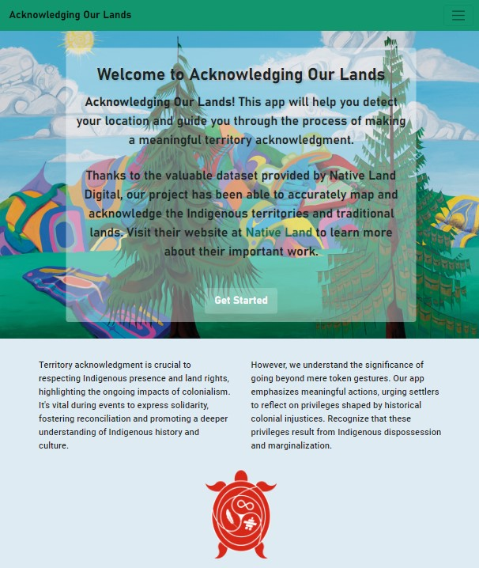
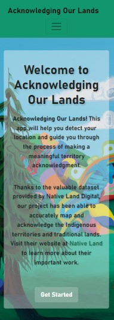
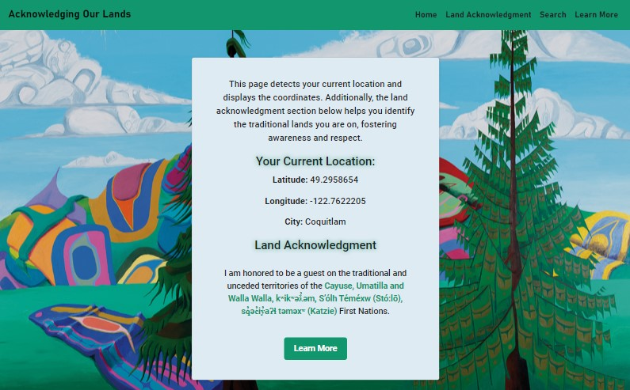
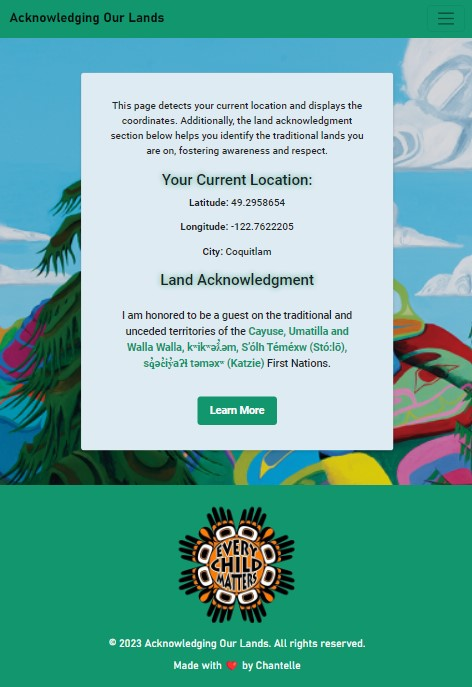

<h2 align="center">
Acknowledging Our Lands  
</h2>

    

    

## Built With

Acknowledging Our Lands was built using these technologies:

- React.js
- React-Router
- Bootstrap
- Axios

## 🛠 Installation and Setup Instructions

1. Installation: `npm install`

2. In the project directory, you can run: `npm start`

Runs the app in the development mode.\
Open [https://chantelle-website-v2.netlify.app/] to view it in the browser.

  
The page will reload if you make edits.
